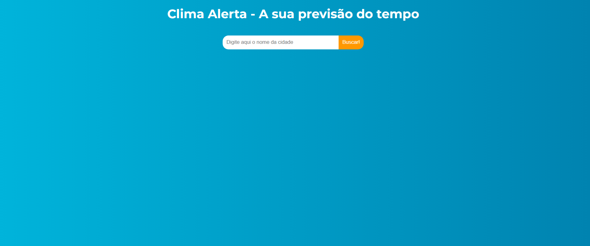
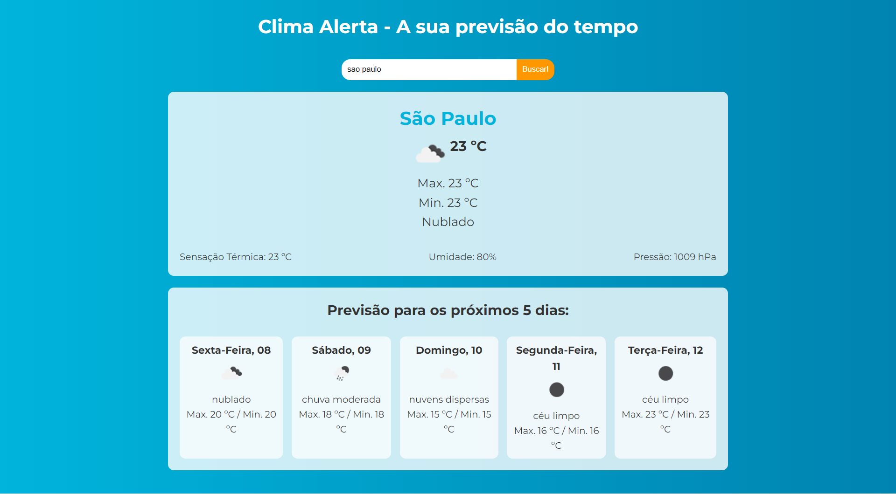

## 🌤️ Clima Alerta

<h3>Descrição:</h3>

O Clima Alerta é um aplicativo de alerta climático que fornece informações meteorológicas em tempo real para ajudar você a se planejar de acordo com as condições climáticas.

<h3>📋 Funcionalidades</h3>
<li>🔍 Pesquisa de Cidades: Encontre o clima de qualquer cidade.</li>
 
<li>🌦️ Informações do Tempo Atual: Exibe temperatura, umidade, e descrição do clima.</li>
 
<li>📆 Previsão para os Próximos Dias: Saiba o clima futuro para se planejar melhor.</li>

<h3>🚀 Tecnologias Utilizadas</h3>
<li>⚛️ React - Interface de usuário</li>
 
<li>⚡ Vite - Ferramenta de build para desenvolvimento rápido</li>
 
<li>🌐 API OpenWeatherMap - Dados meteorológicos</li>
 
<li>🎨 CSS - Estilização e layout</li>

<h3>Imagens do Projeto:</h3>

Pagina Inicial:

 

Pagina de Pesquisa:

